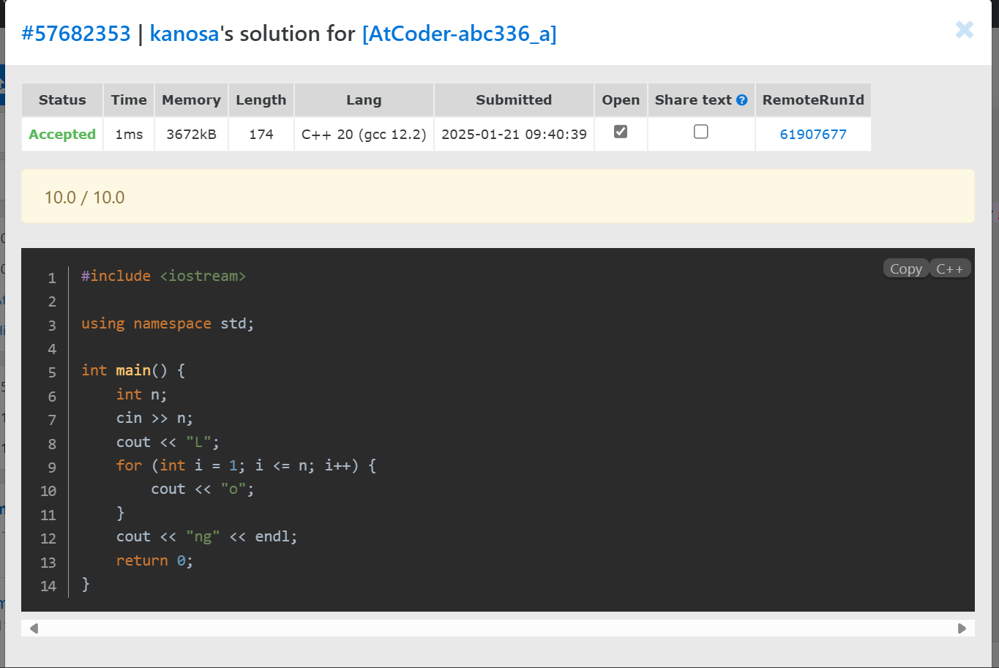

## 2025.1.21

#### 学习内容：C++的基础应用

##### 1.时空复杂度的计算

###### 时间复杂度

时间复杂度是衡量程序效率的量度，它是语句执行次数T 遵循以下规则的化简结果： 1. 常数项化为1； 2. 各项的系数化为1； 3. 只保留最高阶的项； 4. 忽略对数的底数，logan应化为logn。 时间复杂度记作O(f)，其中f 是T 的化简结果。 化简的原则：关注主导因素，忽略次要细节。

###### 空间复杂度

空间复杂度是衡量程序内存占用的量度，它是变量定义次数的化简结果，采用和时间复杂度 完全相同的记号和化简规则

##### 2.常用函数

sort

reverse

##### 3.auto关键字

声明变量时用 auto 代替类型名，让编译器自动推导变量类型。

##### 4.常见STL容器的使用

pair

priority_queue

vector

deque

list

map

set

string

#### 练习内容：vjudge的7道题





仅difficult的第1道题讲解思路

```c++
#include <iostream>
using namespace std;

int main() {
	string key = "abcdefghijklmnopqrstuvwxyz";//模式串
	int N;
	cin >> N;
	string s;
	cin >> s;
	int Q;
	cin >> Q;
    //更新模式串
	for (int i = 0; i < Q; i++) {
		char c1, c2;
		cin >> c1 >> c2;
		for (int j = 0; j < 26; j++) {
			if (key[j] == c1) {
				key[j] = c2;
			}
		}
	}
    //更新文本串
	for (int i = 0; i < N; i++) {
		s[i]=key[s[i]-'a'];
	}
	cout << s << endl;
	return 0;
}
```

题目要求位特定字符的变化，因每个操作遍历复杂度较高，故考虑建立一个模式串直接从让文本串直接转化为最终串

#### 学习总结

1.熟练了auto关键字的使用

2.初步了解了lambda函数的使用、

3.对STL有了进一步的了解
